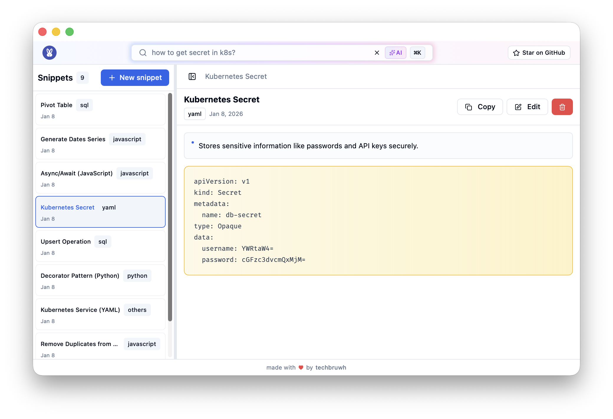

<div align="center">
  
  
  # NoBrainDev
  
  ### A powerful, tiny, AI-powered desktop application for managing your code snippets written in Rust.
  
  
  
  
</div>

## Features
- **Organize Code Snippets** - Store and manage code snippets across multiple languages
- **Smart Search** - Keyword-based search with filtering by title, tags, and content
- **AI Semantic Search** - Natural language search powered by Small Language Models (SLM)
- **Cloud Sync** - Sync snippets across devices (optional)
- **Modern UI** - Beautiful interface built with React, Tailwind CSS, and shadcn/ui
- **Local Storage** - All data stored locally in SQLite database
- **Fast & Lightweight** - Built with Rust and Tauri for native performance
- **Offline First** - Works perfectly without internet, sync when online



## Installation (macOS)

```bash
brew tap techbruwh/nobraindev
brew install nobraindev
```

Update: 
```bash
brew update
brew tap techbruwh/nobraindev
brew upgrade nobraindev
```

## Built With

React • Rust • Tauri • SQLite • AI/ML

## 🤝 Contributing

Want to contribute? 

```bash
git clone https://github.com/techbruwh/nobraindev.git
cd nobraindev
./dev.sh
```

See [CONTRIBUTING.md](CONTRIBUTING.md) for details.

## 📄 License

This project is licensed under the MIT License - see the [LICENSE](LICENSE) file for details.

## 🐛 Issues?

[Open an issue](https://github.com/techbruwh/nobraindev/issues) and we'll help!

## Acknowledgments

- [Tauri](https://tauri.app/) - Desktop app framework
- [sentence-transformers](https://www.sbert.net/) - AI model for semantic search
- [shadcn/ui](https://ui.shadcn.com/) - UI components
- [IconKitchen](https://icon.kitchen/) - Icon Generator

---

Made with ❤️ by [TechBruwh](https://github.com/techbruwh)
